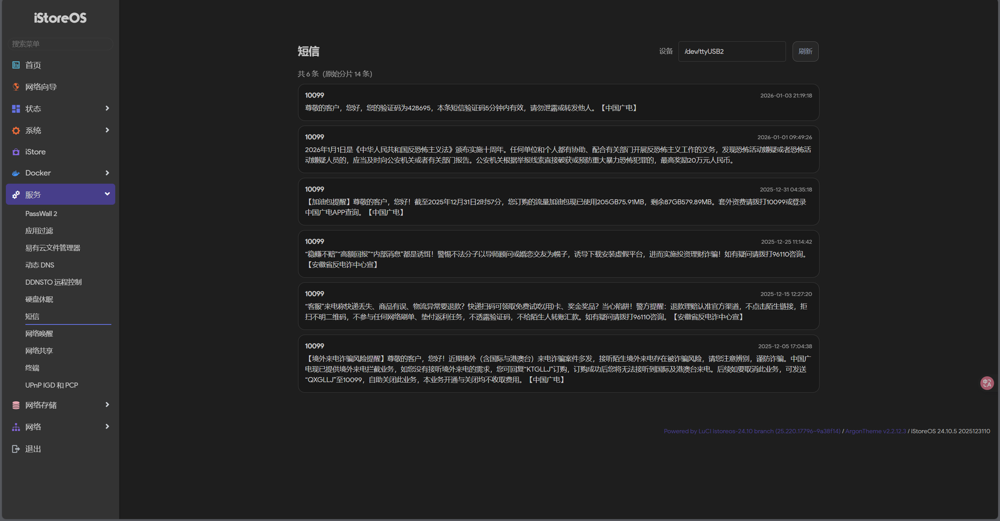

<!DOCTYPE html>
<html lang="zh-CN">
<head>
  <meta charset="UTF-8">
</head>

<body>

  <h1>iStoreOS-SMS</h1>

  

    
    
  

  

    <strong>轻量级 iStoreOS / OpenWrt 短信插件</strong> 
    用于在 <strong>LuCI Web 界面</strong>中读取并展示来自 USB 4G / 5G 调制解调器的 SMS 短信。
  

  <h2>📍 功能特性</h2>
  <ul>
    <li>✔ 正确读取短信（PDU 模式）</li>
    <li>✔ 支持中文 UCS2 解码</li>
    <li>✔ 支持长短信（UDH）自动拼接</li>
    <li>✔ 按时间倒序展示</li>
    <li>× 支持根据号码 / 关键词搜索（后期有需要可能更新支持）</li>
  </ul>

  

  <h2>🚀 一键安装</h2>

  
运行以下命令可快速安装插件：

  <pre><code>sh -c "$(wget -qO- https://raw.githubusercontent.com/mikutea/istoreOS-sms/main/install.sh)"</code></pre>

  
或：

  <pre><code>sh -c "$(curl -fsSL https://raw.githubusercontent.com/mikutea/istoreOS-sms/main/install.sh)"</code></pre>

  

    安装完成后请刷新浏览器 LuCI 页面（建议使用 <strong>Ctrl + F5</strong> 强制刷新缓存）。
  

  <h2>❌ 卸载插件</h2>

  
若需要移除插件，可运行：

  <pre><code>sh -c "$(wget -qO- https://raw.githubusercontent.com/mikutea/istoreOS-sms/main/uninstall.sh)"</code></pre>

  
或：

  <pre><code>sh -c "$(curl -fsSL https://raw.githubusercontent.com/mikutea/istoreOS-sms/main/uninstall.sh)"</code></pre>

  
卸载完成后，“短信” 菜单将从 LuCI 界面中消失。

  <h2>🧠 使用说明</h2>

  <ol>
    <li>安装完成后打开 LuCI 管理界面</li>
    <li>导航路径：<strong>服务 → 短信</strong></li>
    <li>界面中将显示所有已读取的短信</li>
    <li>按 <strong>号码 / 关键词</strong>（如：验证码、流量、银行）进行搜索（后期有需要可能更新支持）</li>
  </ol>

  <h2>⚙️ 配置项（可选）</h2>

  
默认串口设备为：

  <pre><code>/dev/ttyUSB2</code></pre>

  
如果你的调制解调器使用的是其他串口设备，请执行以下命令进行修改：

  <pre><code>uci set smsfix.main.device='/dev/ttyUSB3'
uci commit smsfix
/etc/init.d/uhttpd restart</code></pre>

  <h2>📋 技术细节</h2>

  <ul>
    <li>使用 <code>sms_tool</code> 读取调制解调器中的短信</li>
    <li>使用 <code>ucode</code> 脚本解析短信并输出 JSON 数据</li>
    <li>前端通过 LuCI 调用后端接口并进行渲染展示</li>
  </ul>

  <h2>📌 示例预览</h2>

  

  <h2>🧩 兼容性</h2>

  <table>
    <thead>
      <tr>
        <th>系统版本</th>
        <th>支持情况</th>
      </tr>
    </thead>
    <tbody>
      <tr>
        <td>iStoreOS 24.x / 25.x</td>
        <td>✅ 完全支持</td>
      </tr>
      <tr>
        <td>OpenWrt 22.x / 23.x</td>
        <td>⚠️ 基本兼容</td>
      </tr>
      <tr>
        <td>必须依赖</td>
        <td>sms_tool</td>
      </tr>
    </tbody>
  </table>

  <h2>📄 License</h2>

  
MIT © mikutea

</body>
</html>
